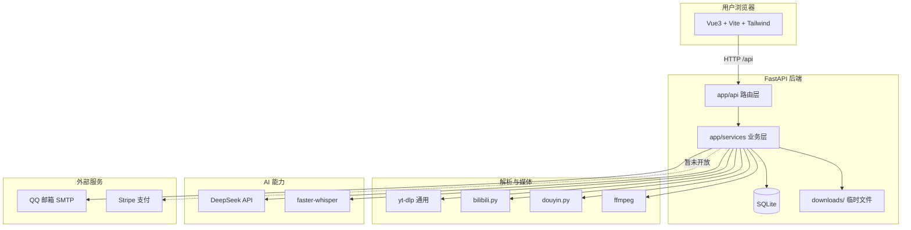

# OmniVid

基于 **yt-dlp** 的智能视频助理，支持 YouTube、Bilibili、抖音、TikTok 等 1800+ 平台。粘贴链接即可解析下载，并自动生成 AI 摘要、思维导图与字幕。

[](https://github.com/creattt840/video-downloader)

## 项目简介

OmniVid（万能视频下载器）采用**前后端分离**架构：前端负责交互与展示，后端统一处理视频解析、下载代理、AI 分析与用户数据。用户无需安装客户端，浏览器即可完成「解析 → 下载 → AI 学习」全流程。

## 系统架构



**请求链路（典型）：** 用户粘贴 URL → 前端调用 `/api/parse` → 后端按平台路由到专用解析器 → 返回统一格式 → 前端展示并触发 `/api/analyze`（SSE 流式 AI 输出）→ 可选 Blob 直链或服务端代理下载。

## 功能模块

| 模块 | 能力 | 前端 | 后端 |
|------|------|------|------|
| **视频解析与下载** | 1800+ 平台解析、多清晰度、直链/Blob/代理下载 | `HeroSection` `VideoResult` | `app/api/video.py` `services/video/` |
| **AI 视频分析** | 摘要、转录、思维导图、文章改写、多轮问答（SSE） | `VideoSummary` `MindMapView` | `app/api/analyze.py` `services/ai/` |
| **字幕** | SRT/VTT/TXT 下载、6 语言翻译、Whisper 兜底 | `VideoResult` | `app/api/subtitles.py` |
| **本地视频上传** | 拖拽上传、外挂字幕、页内预览、AI 分析 | `LocalUploadModal` | `app/api/upload.py` `services/upload/` |
| **用户认证** | 邮箱验证码注册/登录、忘记密码、JWT 会话 | `AuthModal` `useAuth.js` | `app/api/auth.py` `services/email.py` |
| **分析历史** | 云端保存 10 条/用户，含转录/文章/问答 | `HistoryPanel` | `app/api/analysis_history.py` |
| **配额与会员** | 每日 10 次 AI 分析；Stripe VIP（暂未开放） | `UserAccountMenu` `PricingSection` | `app/services/membership.py` `app/api/billing.py` |
| **首页演示** | 未解析时展示 AI 分析样例 | `DemoShowcaseSection` | 静态 JSON |
| **SEO / GEO** | sitemap、robots.txt、llms.txt | `plugins/` `geo/` | — |

## 技术选型

| 层次 | 技术 | 说明 |
|------|------|------|
| 前端框架 | Vue 3 + Vite 7 | 组合式 API、HMR 开发 |
| 样式 | Tailwind CSS v4 | 柔紫 Indigo 主题、响应式布局 |
| 后端框架 | FastAPI + Uvicorn | 异步 API、OpenAPI 文档 |
| 数据库 | SQLite + SQLAlchemy 2 | 用户、配额、分析历史、验证码 |
| 认证 | JWT + bcrypt | 7 天会话；验证码 bcrypt 哈希存储 |
| 邮件 | QQ SMTP（smtplib） | 注册/登录/找回密码 6 位验证码 |
| 下载引擎 | yt-dlp | 1800+ 平台通用解析 |
| 国内平台 | douyin.py + bilibili.py | 专用 API，绕过反爬 |
| 媒体处理 | ffmpeg | YouTube 等 A/V 分离合并 |
| AI 大模型 | DeepSeek + openai SDK | 流式摘要、改写、问答 |
| 语音转写 | faster-whisper | 无字幕视频兜底 |
| 支付 | Stripe Checkout | 代码保留，前端暂未开放 |
| 测试 | pytest + httpx | 30 项单元/集成测试 |

## 快速开始

### 环境要求

- Python 3.10+
- Node.js 18+
- ffmpeg（YouTube 等 A/V 合并，推荐安装）

### 后端

```bash
cd backend
cp .env.example .env   # 配置 DEEPSEEK_API_KEY、JWT_SECRET、SMTP 等
pip install -r requirements.txt
python -m uvicorn main:app --reload --host 0.0.0.0 --port 8000
```

### 前端

```bash
cd frontend
npm install
npm run dev
```

浏览器访问 http://localhost:5173

完整配置说明见 [本地运行指南](docs/本地运行指南.md)。

### 生产构建（SEO / GEO）

```bash
cd frontend
cp .env.example .env   # 设置 VITE_SITE_URL 为正式域名
npm run build
```

详见 [SEO 与 GEO 优化指南](docs/SEO与GEO优化.md)。

## 项目结构

```
video-downloader/
├── docs/                    # 需求、方案、阶段总结、运行指南
├── backend/
│   ├── main.py              # FastAPI 入口
│   ├── app/
│   │   ├── api/             # 路由：video / analyze / auth / upload …
│   │   ├── core/            # 配置、JWT、依赖注入
│   │   ├── db/              # SQLAlchemy 模型与连接
│   │   ├── schemas/         # Pydantic 请求/响应
│   │   └── services/        # 业务：video / ai / upload / email …
│   ├── tests/               # pytest
│   └── downloads/           # 临时下载/上传（自动清理）
└── frontend/
    ├── src/
    │   ├── components/      # 页面组件（Hero、VideoSummary、AuthModal …）
    │   ├── api/             # axios 封装
    │   ├── composables/     # useAuth 等
    │   └── utils/           # 导出、Markdown 渲染
    ├── public/logos/        # 平台官方 SVG
    ├── geo/                 # llms.txt 源文件
    └── plugins/             # 构建时 SEO 插件
```

## API 文档

启动后端后访问 http://localhost:8000/docs

## 文档索引

| 文档 | 说明 |
|------|------|
| [需求分析](docs/需求分析.md) | 产品需求与分期计划 |
| [方案设计](docs/方案设计.md) | 架构、API、目录、UI 规范 |
| [本地运行指南](docs/本地运行指南.md) | 环境配置、测试流程、常见问题 |
| [SEO 与 GEO 优化](docs/SEO与GEO优化.md) | 构建时 SEO/GEO 配置 |
| [阶段总结-邮箱验证码登录](docs/阶段总结-邮箱验证码登录.md) | SMTP 验证码认证 |
| [阶段总结-用户登录与VIP会员](docs/阶段总结-用户登录与VIP会员.md) | JWT、Stripe、配额 |
| [阶段总结-用户分析历史](docs/阶段总结-用户分析历史.md) | 云端历史与配额策略 |
| [阶段总结-AI视频总结功能](docs/阶段总结-AI视频总结功能.md) | DeepSeek、SSE、思维导图 |
| [阶段总结-本地视频上传解析](docs/阶段总结-本地视频上传解析.md) | 本地上传与 Whisper |
| [阶段总结-后端工程化重构](docs/阶段总结-后端工程化重构.md) | 分层目录与路由拆分 |
| [阶段总结-首页成果展示](docs/阶段总结-首页成果展示.md) | Demo 样例数据 |

更多阶段总结见 `docs/` 目录。

## 测试

```bash
cd backend
pip install pytest httpx
python -m pytest tests/ -v
```

## 免责声明

本站仅供个人学习交流使用，请勿用于商业或侵权用途。下载内容的版权归原作者所有。
