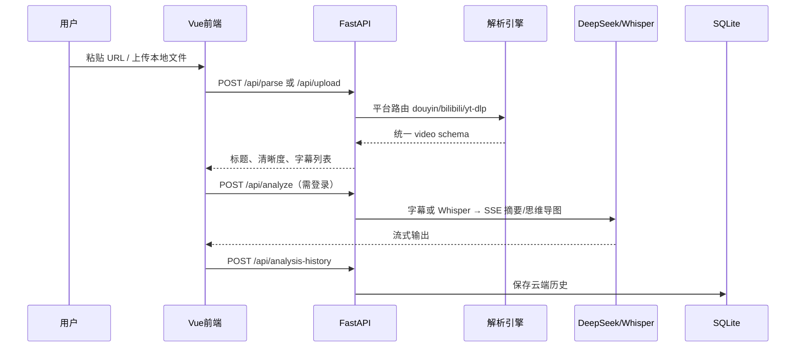

# OmniVid - 方案设计文档

## 1. 技术架构

### 1.1 总体架构图

```
┌──────────────────────────────────────────────────────────────────────┐
│                        用户浏览器（含移动端）                          │
│  ┌────────────────────────────────────────────────────────────────┐  │
│  │              Vue 3 + Vite 7 + Tailwind CSS v4                  │  │
│  │  Hero 解析 │ VideoResult 下载 │ VideoSummary AI │ AuthModal    │  │
│  └────────────────────────────┬───────────────────────────────────┘  │
└───────────────────────────────┼──────────────────────────────────────┘
                                │ HTTP /api（Vite 开发代理 → :8000）
┌───────────────────────────────┼──────────────────────────────────────┐
│                     FastAPI 后端（Python 3.10+）                       │
│  ┌────────────────────────────┴───────────────────────────────────┐  │
│  │  app/api/          路由层（video / analyze / auth / upload …）   │  │
│  │  app/schemas/      Pydantic 请求/响应校验                          │  │
│  │  app/core/         配置、JWT、依赖注入                             │  │
│  │  app/services/     业务逻辑层                                    │  │
│  │    video/          yt-dlp / bilibili / douyin                     │  │
│  │    ai/             DeepSeek 摘要 / Whisper 转写 / 字幕            │  │
│  │    upload/         本地文件上传与 TTL 清理                        │  │
│  │    email/          QQ SMTP 验证码邮件                             │  │
│  │    verification/   验证码生成、频率限制、验码                        │  │
│  │    membership/     每日配额、VIP 判定                             │  │
│  │  app/db/           SQLite ORM（users / history / codes …）       │  │
│  └──────────────────────────────────────────────────────────────────┘  │
│  downloads/  临时下载与上传目录（shutdown / TTL 自动清理）               │
└───────────────────────────────┬──────────────────────────────────────┘
                                │
        ┌───────────────────────┼───────────────────────┐
        ▼                       ▼                       ▼
   yt-dlp + ffmpeg         DeepSeek API            QQ SMTP
   B站/抖音专用 API        faster-whisper          Stripe（暂未开放）
```

### 1.2 数据流（解析 + AI 分析）



## 2. 功能模块

| 模块 ID | 名称 | 核心 API | 服务层 | 前端组件 |
|---------|------|----------|--------|----------|
| M1 | 视频解析下载 | `/api/parse` `/api/download` `/api/direct-url` | `services/video/` | `HeroSection` `VideoResult` |
| M2 | AI 分析 | `/api/analyze/*` | `services/ai/` | `VideoSummary` `MindMapView` |
| M3 | 字幕 | `/api/subtitles/*` | `services/ai/subtitles.py` | `VideoResult` |
| M4 | 本地上传 | `/api/upload/*` | `services/upload/` | `LocalUploadModal` |
| M5 | 用户认证 | `/api/auth/*` | `email.py` `verification.py` | `AuthModal` `useAuth.js` |
| M6 | 分析历史 | `/api/analysis-history/*` | `analysis_history.py` | `HistoryPanel` |
| M7 | 会员配额 | `/api/billing/*` + 门控 | `membership.py` | `UserAccountMenu` `PricingSection` |
| M8 | 首页演示 | —（静态 JSON） | — | `DemoShowcaseSection` |

**模块依赖关系：**

- M2/M3 依赖 M1 或 M4 提供的视频源
- M2/M3/M6 依赖 M5 登录态与每日配额（10 次/日）
- M7 Stripe 支付代码保留，checkout 当前返回 503

## 3. 技术栈选型

| 层次 | 技术 | 选型理由 |
|------|------|----------|
| 前端 | Vue 3 + Vite 7 + Tailwind CSS v4 | 轻量、开发快、响应式友好 |
| 后端 | FastAPI + Uvicorn | 异步高性能、Python 生态、OpenAPI |
| 数据库 | SQLite + SQLAlchemy 2 | 轻量部署，用户/历史/验证码 |
| 下载引擎 | yt-dlp | 14w+ Star，1800+ 平台 |
| 国内平台 | douyin.py + bilibili.py | 专用公开 API，绕过反爬 |
| 媒体合并 | ffmpeg（系统依赖） | YouTube 等 A/V 分离合并 |
| AI | DeepSeek + openai SDK + faster-whisper | 流式摘要、字幕转写 |
| 认证 | JWT + bcrypt + 邮箱验证码 | 注册验邮、双模式登录、找回密码 |
| 邮件 | QQ SMTP（smtplib） | 开发/小规模真实发码 |
| 支付 | Stripe Checkout（一次性） | Test/Live 模式，Webhook 开通 VIP（暂未开放） |

## 4. API 设计（第一期）

### 4.1 解析视频

```
POST /api/parse
{ "url": "https://..." }

→ 200 { "success": true, "data": { id, title, thumbnail, formats[], ... } }
→ 400 { "success": false, "error": "..." }
```

### 4.2 下载视频

```
POST /api/download
{ "url": "...", "format_id": "bestvideo+bestaudio/best" }

→ FileResponse (application/octet-stream)
```

### 4.3 获取直链

```
POST /api/direct-url
{ "url": "...", "format_id": "..." }

→ { "success": true, "data": { direct_url, ext, filesize } }
```

### 4.4 缩略图代理

```
GET /api/proxy/thumbnail?url=...

→ 图片流（绕过防盗链）
```

### 4.5 健康检查

```
GET /api/health → { "status": "ok", "ffmpeg": bool, "ai_available": bool }
```

### 4.6 下载字幕（第 4 阶段扩展）

```
POST /api/subtitles/download
{ "url": "...", "format": "srt" | "vtt" | "txt" }

→ FileResponse（字幕文件）
→ 响应头 X-Transcript-Source: subtitle | whisper
```

### 4.7 AI 分析（第 4 阶段）

```
POST /api/analyze          → { session_id, ... }
GET  /api/analyze/{id}/stream  → SSE（transcript / summary / mindmap）
POST /api/analyze/{id}/chat    → SSE 多轮问答
GET  /api/analyze/{id}/rewrite → SSE AI 改写文章
POST /api/subtitles/translate  → 字幕翻译下载（6 语言，需登录）
```

### 4.8 分析历史（已实现）

```
GET    /api/analysis-history              → 列表（每用户最多 10 条）
POST   /api/analysis-history              → 保存/更新（partial 增量同步）
DELETE /api/analysis-history/{id}         → 删除单条
DELETE /api/analysis-history              → 清空
POST   /api/analysis-history/{id}/chat    → SSE 继续问答
GET    /api/analysis-history/{id}/rewrite → SSE 生成改写文章
```

### 4.9 用户认证（第 5 阶段）

```
POST /api/auth/send-code     → 发送邮箱验证码（register / login / reset_password）
POST /api/auth/register      → { email, password, code }
POST /api/auth/login         → { email, password } 或 { email, code }
POST /api/auth/reset-password → { email, code, new_password }
GET  /api/auth/me            → { id, email, ai_usage_today, ai_daily_limit, membership_enabled }
```

### 4.10 Stripe 支付（第 6 阶段，当前暂未开放）

```
POST /api/billing/checkout  → 503 会员功能暂未开放
POST /api/billing/webhook   → Stripe 回调（保留，供后续启用）
```

AI 分析门控：`POST /api/analyze` 需登录；**每账号每日 10 次**；改写/翻译/PDF 登录即可用（仍消耗分析配额的是「开始分析」动作）。

### 4.11 侧滑导航（功能扩展阶段）

- 左侧 `SideMenuDrawer`：新建解析、分析历史、本地视频上传、使用帮助、营销锚点
- 右侧 `HistoryPanel`：云端分析历史（每用户最多 10 条，需登录）

### 4.12 本地视频上传（已实现）

```
POST /api/upload
  Content-Type: multipart/form-data
  Fields: media (required), subtitle (optional, srt/vtt)
  → 200 { success, data: { file_id, title, duration, platform: "本地文件", ... } }
  → 400 格式/大小/时长超限

GET /api/upload/{file_id}/stream
  → FileResponse（页内 video/audio 预览）

POST /api/analyze
  Body: { "url": "..." }  OR  { "file_id": "..." }（二选一）
  → 有外挂字幕时 transcript_source=subtitle，否则 Whisper 转写
```

限制：`UPLOAD_MAX_SIZE_MB=500`，`UPLOAD_MAX_DURATION=3600`（60 分钟）。上传文件 TTL 30 分钟，服务 shutdown 自动清理。

## 5. 平台路由与统一响应格式

所有 parser 返回相同 schema，前端平台无关：

```python
{
    "id", "title", "thumbnail", "duration", "duration_string",
    "uploader", "platform", "view_count", "upload_date", "description",
    "formats": [{
        "format_id", "ext", "resolution", "height",
        "label", "has_audio", "filesize"
    }],
    "subtitles": [...],
    "automatic_captions": [...]
}
```

路由优先级：`抖音 URL → B站 URL → yt-dlp 通用`

## 6. 前端 UI 设计（OmniVid）

品牌名：**OmniVid**（智能视频助理）

| 元素 | 规范 |
|------|------|
| 页面背景 | `#F5F7FF` 淡紫灰 |
| 主色 | `#6366F1` 柔紫 Indigo |
| 卡片 | 白色、`rounded-2xl/3xl`、轻阴影 |
| 标题 | 「智能视频助理，**一键保存**」— 关键词主色 |
| 输入框 | 居中紧凑条 `rounded-2xl`，右侧「解析 →」按钮 |
| 标签 | hashtag 风格 `#YouTube • #1080P • #无水印` |
| Header | 汉堡侧滑菜单 + 居中 OmniVid Logo + 分析历史 + 登录入口 |
| 转化区 | 功能卡片 + 免费/会员对比定价（会员暂未开放） |
| 页面容器 | `.page-container` 最大宽度 1440px |

### 页面结构

1. **Header** — 汉堡侧滑菜单（工具/了解）+ Logo + 分析历史 + 登录入口（占位）
2. **Hero** — 主标题 + 紧凑 URL 输入
3. **工作区** — 统一卡片双栏：左 `VideoResult`（下载）+ 右 `VideoSummary`（AI 分析，解析后自动触发）
4. **PlatformSection** — 平台卡片网格（官方品牌 Logo）
5. **FeatureSection** — 5 大特性
6. **HowToSection** — 三步使用指南
7. **PricingSection** — 免费方案 + 会员占位（暂未开放）；未登录点击「免费使用」打开登录弹窗，已登录点击「立即使用」滚动至顶部并聚焦 URL 输入
8. **Footer** — 免责声明

### 平台 Logo 资源

首页平台介绍区使用 `frontend/public/logos/` 下的官方品牌 SVG：

| 文件 | 平台 |
|------|------|
| `youtube.svg` | YouTube |
| `bilibili.svg` | Bilibili 小电视（`#FB7299`） |
| `tiktok.svg` | 抖音 / TikTok |
| `x.svg` | Twitter / X |
| `instagram.svg` | Instagram |
| `twitch.svg` | Twitch |

### 下载策略

1. 优先调用 `/api/direct-url` 获取 CDN 直链
2. 前端 `fetch` 拉取为 Blob 后触发浏览器保存（避免跨域 `<a download>` 失效）
3. CORS 拦截或直链不可用时，回退 `POST /api/download` 服务端代理

## 7. 项目目录结构

```
video-downloader/
├── docs/
│   ├── 需求分析.md
│   └── 方案设计.md
├── backend/
│   ├── main.py                 # 应用入口（创建 FastAPI、注册路由）
│   ├── requirements.txt
│   ├── pytest.ini
│   ├── .env.example
│   ├── downloads/              # 临时下载/上传目录
│   ├── app/
│   │   ├── api/                # 路由层（health / video / upload / analyze / auth …）
│   │   ├── core/               # 配置、依赖注入、JWT 安全
│   │   ├── db/                 # SQLAlchemy 连接与 ORM 模型
│   │   ├── schemas/            # Pydantic 请求/响应模型
│   │   └── services/           # 业务逻辑（video / ai / upload / email / membership …）
│   └── tests/                  # pytest 单元测试
├── frontend/
│   ├── public/
│   │   └── logos/              # 平台官方品牌 SVG
│   ├── src/
│   │   ├── App.vue
│   │   ├── style.css
│   │   ├── api/video.js
│   │   └── components/
│   ├── index.html
│   ├── vite.config.js
│   └── package.json
└── README.md
```

## 8. 环境依赖

- Python 3.10+
- Node.js 18+
- ffmpeg（PATH 可用，YouTube 等平台 A/V 合并）
- yt-dlp（pip 安装）

## 9. 风险与应对

| 风险 | 应对 |
|------|------|
| B 站 412 反爬 | bilibili.py 专用公开 API |
| 抖音 WAF | WAF 解算 + 分享页回退 |
| 移动端大文件超时 | Axios timeout 600s + 进度提示 |
| 服务器带宽 | 优先 direct-url + Blob 下载，失败回退服务端代理 |
| 版权合规 | Footer 免责声明 |

## 10. 后续扩展（第 8 阶段）

- Docker 部署与生产环境 Stripe Live 配置
- 字幕翻译、批量下载
- 笔记同步（Notion / Obsidian / PDF）

> 第 5–6 阶段（用户登录 + Stripe VIP）已实现；当前会员支付暂未开放，详见 `docs/阶段总结-用户登录与VIP会员.md` 与 `docs/阶段总结-用户分析历史.md`。
